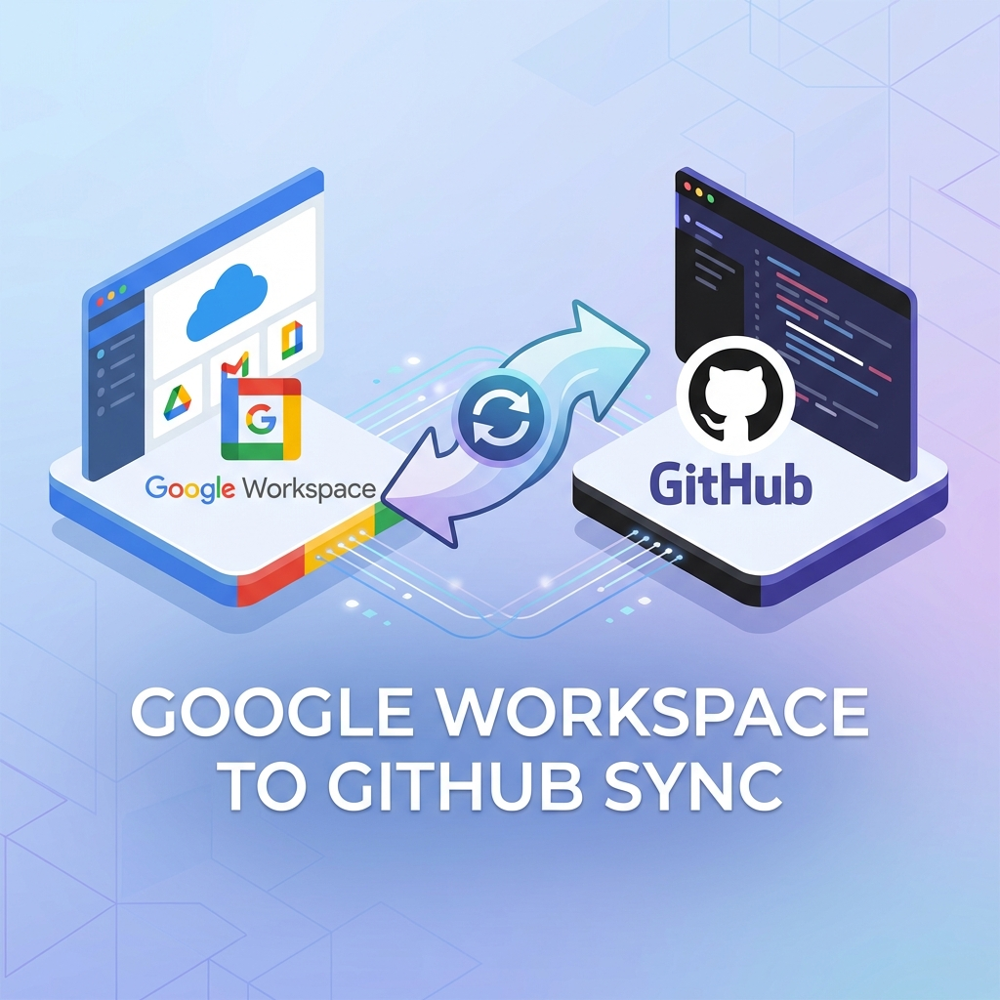

# Google Workspace to GitHub Organization Sync




Sync members and owners from Google Workspace Groups into a GitHub organization via AWS Lambda or a local CLI.

## Overview

This tool keeps GitHub organization membership aligned with Google Workspace groups:

- Invites members and owners based on group membership
- Optionally removes GitHub members missing from Google Groups
- Updates roles for member ↔ owner transitions
- Dry-run mode for safe previews
- Scheduled execution with EventBridge

## Quickstart (AWS SAM)

### 1) Prerequisites

- AWS account + AWS CLI configured
- SAM CLI installed
- Go 1.25+
- Google Workspace Admin access
- GitHub organization admin access
- **Critical Requirement**:
  - The company domain (e.g., `yourdomain.com`) **must be verified** in the GitHub organization settings.
  - Users **must** have their work email (e.g., `user@yourdomain.com`) added to their GitHub account (it can be a secondary email).
  > **Why?** This allows the tool to reliably map Google Workspace emails to GitHub users without requiring SAML SSO. If a user's work email is not on their GitHub account, they cannot be matched or invited correctly.

### 2) Create Google credentials

- Create a Google Cloud service account
- Enable **Domain-Wide Delegation**
- Grant Admin SDK scopes for Directory APIs

Use the detailed setup in [docs/configuration.md](docs/configuration.md).

### 3) Create a GitHub token

- Create a GitHub Personal Access Token with `admin:org`

### 4) Store secrets in AWS Secrets Manager

Create two secrets:

```
aws secretsmanager create-secret \
  --name google-workspace-github-sync/google-credentials \
  --secret-string file://credentials.json

aws secretsmanager create-secret \
  --name google-workspace-github-sync/github-token \
  --secret-string "ghp_your_token_here"
```

### 5) Configure the app

```
cp config.yaml.example config.yaml
```

Update the following in `config.yaml`:

- `google.admin_email`
- `google.members_group`
- `google.owners_group`
- `github.organization`

### 6) Build and deploy

```
sam build
sam deploy --guided
```

When prompted, set the parameters:

- `GoogleCredentialsSecretName` → `google-workspace-github-sync/google-credentials`
- `GitHubTokenSecretName` → `google-workspace-github-sync/github-token`

### 7) Verify

Check CloudWatch logs for the `google-workspace-github-sync` Lambda function after the first scheduled run.

## Configuration Options

You can configure via environment variables, a config file, or CLI flags. See:

- [docs/configuration.md](docs/configuration.md)

Key environment variables:

```
GOOGLE_ADMIN_EMAIL=admin@yourdomain.com
GOOGLE_CREDENTIALS_FILE=/path/to/credentials.json
GOOGLE_CREDENTIALS_SECRET=google-workspace-github-sync/google-credentials
GOOGLE_MEMBERS_GROUP=github-members@yourdomain.com
GOOGLE_OWNERS_GROUP=github-owners@yourdomain.com
GITHUB_ORG=your-github-org
GITHUB_TOKEN=ghp_xxx
GITHUB_TOKEN_SECRET=google-workspace-github-sync/github-token
LOG_LEVEL=info
LOG_FORMAT=json
DRY_RUN=true
IGNORE_SUSPENDED=true
REMOVE_EXTRA_MEMBERS=false
```

## Local CLI (optional)

```
go build -o google-workspace-github-sync .
./google-workspace-github-sync --config config.yaml --dry-run
```

## Documentation

- [docs/README.md](docs/README.md)
- [docs/architecture.md](docs/architecture.md)
- [docs/sync-logic.md](docs/sync-logic.md)
- [docs/invitation-reconciliation.md](docs/invitation-reconciliation.md)
- [docs/api-reference.md](docs/api-reference.md)
- [docs/deployment.md](docs/deployment.md)
- [docs/local-development.md](docs/local-development.md)

## Contributing

See [CONTRIBUTING.md](CONTRIBUTING.md).

## License

MIT — see [LICENSE](LICENSE).
