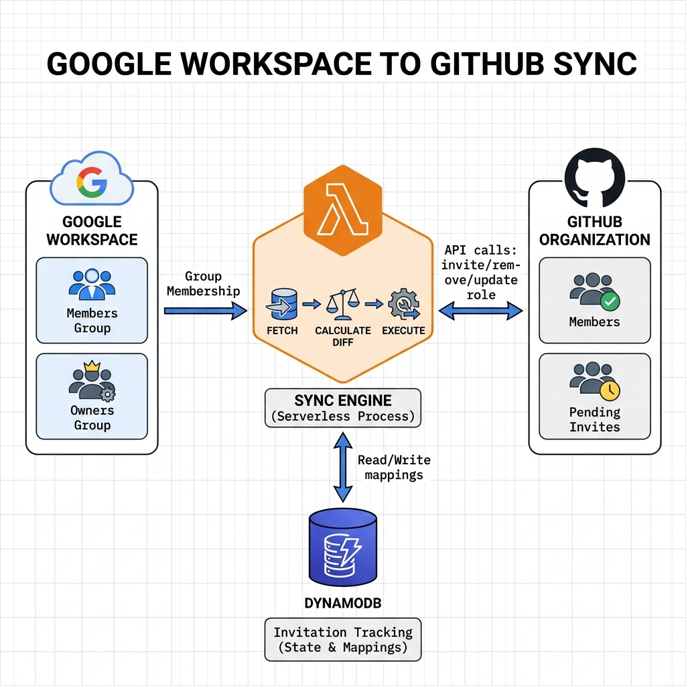

# Architecture

## Overview

**google-workspace-github-sync** synchronizes membership from two Google Workspace groups (members + owners) into a GitHub organization. It can run as a **CLI tool** or as an **AWS Lambda** function on a schedule.


## Components

### Google Client (`internal/google`)

Reads group membership from Google Workspace Admin SDK.

- **GetGroupMembers** — lists members of a Google group (includes derived/nested membership)
- **GetUsersSuspendedStatus** — checks whether users are suspended in Google Workspace

Requires a **service account** with domain-wide delegation and the following scopes:
- `admin.directory.group.member.readonly`
- `admin.directory.user.readonly`
- `admin.directory.group.readonly`

### GitHub Client (`internal/github`)

Manages GitHub organization membership via the GitHub REST API.

| Method | API Endpoint | Purpose |
|--------|-------------|---------|
| `ListMembers` | `GET /orgs/{org}/members` | Two-pass: admin set → all members → email enrichment |
| `ListPendingInvitations` | `GET /orgs/{org}/invitations` | List pending org invitations |
| `CreateInvitation` | `POST /orgs/{org}/invitations` | Send org invitation by email |
| `RemoveMember` | `DELETE /orgs/{org}/members/{user}` | Remove member from org |
| `UpdateMemberRole` | `PUT /orgs/{org}/memberships/{user}` | Change member role (admin/member) |
| `CancelInvitation` | `DELETE /orgs/{org}/invitations/{id}` | Cancel a pending invitation |
| `SearchUserByEmail` | `GET /search/users?q={email}+in:email` | Find GitHub username from email |
| `GetAuditLogAddMemberEvents` | `GET /orgs/{org}/audit-log` | Fetch `org.add_member` events |
| `ListFailedInvitations` | `GET /orgs/{org}/failed_invitations` | List failed invitations |
| `ListMembersWithVerifiedEmails` | `POST /graphql` (GraphQL) | Map verified-domain emails → usernames |

#### Two-pass admin detection

GitHub's List Members API does not reliably return role information in a single call. The client uses a two-pass approach:

1. **Pass 1**: Fetch members with `role=admin` filter → build an admin set
2. **Pass 2**: Fetch all members with `role=all` → tag each user as `admin` if in the admin set, `member` otherwise
3. **Pass 3**: For members with no email, call `GET /users/{login}` to enrich with public profile email

#### Verified domain emails (GraphQL)

`ListMembersWithVerifiedEmails` uses the GitHub GraphQL API to query `organizationVerifiedDomainEmails` for all org members. This returns email addresses that belong to domains **verified** by the organization — even if the user's email is set to private.

- **Requires**: GitHub Enterprise Cloud with at least one verified domain
- **Does NOT require**: SAML SSO
- **Returns**: `map[lowercase-email]username` for all org members who have a verified-domain email
- **Pagination**: Cursor-based via GraphQL `after` parameter

### Sync Engine (`internal/sync`)

Orchestrates the entire sync pipeline:

```
Google Groups ─┐
               ├──► CalculateDiff() ──► []SyncAction ──► ExecuteActions() ──► Reconcile()
GitHub Org ────┤         ▲                                                        │
               │         │                                                        ▼
Verified ──────┘    EmailMappings                                   EnsureVerifiedEmailMappings()
  Emails        (from DynamoDB)                                     (create EXISTING# records)
```

### DynamoDB Store (`internal/dynamodb`)

Persistent invitation tracking for email→username mapping. See [Invitation Reconciliation](invitation-reconciliation.md) for details.

### Config (`internal/config`)

Configuration loading via Viper: YAML file → environment variables → CLI flags. See [Configuration](configuration.md).

## Execution Modes

### CLI Mode

```bash
./google-workspace-github-sync --config config.yaml
```

Detected when `AWS_LAMBDA_FUNCTION_NAME` is **not** set. Uses Cobra for CLI argument parsing.

### Lambda Mode

Triggered by Amazon EventBridge scheduled events. Detected when `AWS_LAMBDA_FUNCTION_NAME` **is** set. Credentials are loaded from AWS Secrets Manager instead of local files.

## Data Flow

```
1.  Google Workspace
    ├── GetGroupMembers(members_group) → []GoogleGroupMember
    └── GetGroupMembers(owners_group)  → []GoogleGroupMember
    
2.  (optional) GetUsersSuspendedStatus() → mark suspended users

3.  GitHub Organization
    ├── ListMembers(org) → []GitHubOrgMember (with accurate roles)
    └── ListPendingInvitations(org) → []GitHubOrgMember (pending)

4.  DynamoDB (optional)
    ├── GetAllResolvedMappings(org) → map[email]username
    └── GetPendingInvitations(org) → map[email]invitationID

4b. GitHub GraphQL (optional, requires Enterprise Cloud + verified domain)
    └── ListMembersWithVerifiedEmails(org) → map[email]username

5.  CalculateDiff(google, github, mappings, verifiedEmails) → []SyncAction
    Actions: invite | remove | update_role | cancel_invite

6.  ExecuteActions(actions) → []SyncAction (with execution results)
    - Invite "already in org" → SearchUserByEmail → UpdateMemberRole

7.  Reconcile(actions) → ReconcileResult
    - Save new invitations to DynamoDB
    - Resolve pending → login via pending invites or audit log
    - Mark failed/expired/cancelled/removed
    - Handle already-in-org users (create EXISTING# records)

8.  EnsureVerifiedEmailMappings(verifiedEmails, membersGroup, ownersGroup)
    - For Google members matched via verified emails without a DynamoDB record
    - Creates EXISTING#<username> records with the correct role (member/admin)
```

## Dependencies

| Dependency | Version | Purpose |
|-----------|---------|---------|
| `go-github/v60` | v60.0.0 | GitHub REST API |
| `google.golang.org/api` | v0.265.0 | Google Admin SDK |
| `aws-sdk-go-v2` | v1.41.1 | DynamoDB, CloudWatch, Secrets Manager |
| `aws-lambda-go` | v1.52.0 | Lambda handler |
| `cobra` | v1.10.2 | CLI framework |
| `viper` | v1.21.0 | Configuration management |
| `logrus` | v1.9.4 | Structured logging |
