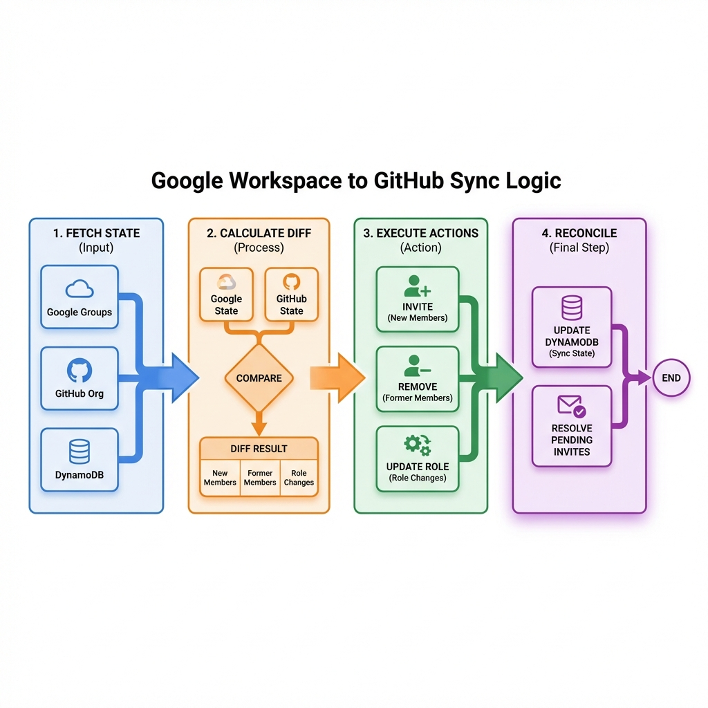

# Sync Logic

This document explains how the tool calculates what changes to make and how it handles edge cases.

---

## Sync Pipeline

Each sync run follows this pipeline:



### Step 1: Fetch State

1. Fetch all members from `members_group` (Google) → desired role: `member`
2. Fetch all members from `owners_group` (Google) → desired role: `admin`
3. If `ignore_suspended: true`, fetch suspension status and mark suspended users
4. Fetch GitHub org members (two-pass admin detection for accurate roles)
5. Fetch GitHub pending invitations
6. Load DynamoDB email→username mappings (if DynamoDB enabled)
7. Fetch verified domain emails via GraphQL (if Enterprise Cloud + verified domain)

### Step 2: Calculate Diff

`CalculateDiff()` compares desired state (Google) vs current state (GitHub) and produces a list of `SyncAction` items.

### Step 3: Execute Actions

`ExecuteActions()` runs each action against the GitHub API (unless in dry-run mode).

### Step 4: Reconcile

`Reconcile()` updates DynamoDB invitation records based on execution results.

---

## Action Types

| Action | Description | `Email` field contains |
|--------|-------------|----------------------|
| `invite` | Send org invitation | Google email address |
| `remove` | Remove member from org | GitHub username |
| `update_role` | Change member's role (admin↔member) | GitHub username |
| `cancel_invite` | Cancel a pending invitation | Google email address |
| `skip` | No-op placeholder | — |

---

## Diff Algorithm

### Building the "known" set

The diff first builds a set of identifiers already present in GitHub:

```
known = { lowercase(member.Email or member.Username) for each GitHub member }
     ∪ { lowercase(invite.Email or invite.Username) for each pending invite }
```

If DynamoDB mappings are available, resolved email→username mappings are also added to the "known" set (bridging the gap when GitHub members don't have public emails).

If verified domain emails are available (from GraphQL `organizationVerifiedDomainEmails`), they are added too — with DynamoDB mappings taking precedence over verified emails when both exist for the same email.

### Desired state

The desired state is built from Google groups:

```
desired = {}
for member in members_group:
    if member.IsActive():
        desired[lowercase(email)] = { email, role: member }
for owner in owners_group:
    if owner.IsActive():
        desired[lowercase(email)] = { email, role: admin }  # owners override members
```

### Invite actions

For each Google user **not** in the "known" set → emit `ActionInvite`.

### Remove actions

Two modes controlled by `remove_extra_members`:

#### Conservative mode (`remove_extra_members: false`) — Default

Only removes GitHub members that:
1. Are tracked in DynamoDB (were added by this tool)
2. Are no longer in any Google group

Pre-existing org members (added manually or before the tool existed) are **never touched**.

```
for each GitHub member:
    username = member.Username
    googleEmail = DynamoDB reverse lookup (username → email)
    if not tracked in DynamoDB → skip (pre-existing member)
    if googleEmail is still in Google groups → skip
    → emit ActionRemove
```

> **Requires DynamoDB enabled.** If DynamoDB is disabled in conservative mode, no removals occur.

#### Aggressive mode (`remove_extra_members: true`)

Removes **all** GitHub members not present in any Google group, regardless of how they were added.

```
for each GitHub member:
    if member.Email in Google groups → skip
    if DynamoDB reverse lookup (username → email) in Google groups → skip
    → emit ActionRemove
```

### Cancel invitation actions

When DynamoDB is enabled, pending invitations for users no longer in Google groups are cancelled. This works in **both** modes.

Sources checked:
1. GitHub API pending invitations (matched by email)
2. DynamoDB pending mappings (for invitations the tool knows about)

Duplicates between the two sources are automatically de-duplicated.

### Role change actions

For each GitHub member, the diff checks if the desired role (from Google) differs from the current role:

```
for each GitHub member:
    desired = lookup by email OR DynamoDB reverse lookup (username → email → desired role)
    if desired role ≠ current role → emit ActionUpdateRole
```

---

## Verified Domain Email Matching

When the GitHub organization has a **verified domain** (Enterprise Cloud), the tool queries the GraphQL API for `organizationVerifiedDomainEmails` to build a `map[email]username` for all org members.

This enables **proactive matching** before the diff even runs:
- If a Google user's email matches a verified email → the user is recognized as already in the org
- No invite action is generated (avoids the 422 error entirely)
- Role mismatches are detected and handled via `ActionUpdateRole`
- A DynamoDB `EXISTING#<username>` record is created automatically (see below)

> **Note**: This mechanism does NOT require SAML SSO. It only requires that the organization has at least one verified domain and that users have added their work email to their GitHub account.

### DynamoDB records for verified email matches

When verified emails prevent an invite at diff time, no `SyncAction` is generated. To ensure these users are tracked in DynamoDB (for future role changes and removals), the engine runs `EnsureVerifiedEmailMappings` after reconciliation:

1. For each verified email mapping (email → username):
   - Check if the email is in the Google groups (desired state)
   - Check if a resolved DynamoDB mapping already exists
   - If not, create an `EXISTING#<username>` record with the **correct role** (member or admin, based on which Google group the user belongs to)

This ensures that even users matched proactively via verified emails are fully tracked for conservative-mode removals and role changes.

---

## Invite → Role Update Upgrade

A key edge case: when a Google user is already in the GitHub org but the tool can't match them by email (because their GitHub profile email is private and no DynamoDB mapping exists).

**Flow:**

```
1. CalculateDiff sees Google user not in "known" set → ActionInvite
2. ExecuteActions calls CreateInvitation
3. GitHub API returns 422 "already a member"
4. Tool calls SearchUserByEmail (GET /search/users?q={email}+in:email)
5. If exactly 1 match found:
   a. Calls UpdateMemberRole(username, desiredRole)
   b. Mutates action: type → update_role, Executed → true
6. If no match: marks action as AlreadyInOrg with error
```

This mechanism ensures role changes work even when email matching fails, as long as the user's email is associated with their GitHub account (even if private).

---

## Suspension Handling

When `ignore_suspended: true` (default):

1. All unique emails from both Google groups are collected
2. `GetUsersSuspendedStatus()` checks each user's admin directory record
3. Suspended users have `IsSuspended = true` set on their `GoogleGroupMember`
4. `IsActive()` returns `false` for suspended users
5. The diff skips inactive users — they are neither invited nor used for role determination

---

## Dry Run Mode

When `dry_run: true` (default):

- Actions are **calculated** but **not executed**
- Each planned action is logged with `[DRY RUN]` prefix
- No GitHub API calls are made (no invites, removals, or role changes)
- No DynamoDB reconciliation is performed
- The summary reports planned actions

This is the default mode to prevent accidental changes.

---

## Orphaned GitHub Users

The summary includes a list of "orphaned" GitHub members — org members not matched to any Google group email.

Matching is attempted in three ways:
1. **Direct match**: GitHub member's email/username is in the Google groups
2. **DynamoDB reverse lookup**: username → email via resolved DynamoDB mappings
3. **Verified email reverse lookup**: username → email via GraphQL verified domain emails

If none of these match, the user is reported as orphaned.

> **Note**: This is a diagnostic aid. Orphaned users are only removed if `remove_extra_members: true` or if they're tracked in DynamoDB (conservative mode).

---

## Summary Output

Each run produces a structured summary:

```json
{
  "total_google_members": 10,
  "total_github_members": 15,
  "pending_invitations": 2,
  "actions_planned": 5,
  "actions_executed": 4,
  "actions_failed": 1,
  "invited": 3,
  "already_in_org": 1,
  "removed": 0,
  "role_updated": 1,
  "skipped": 0,
  "orphaned_github": 8
}
```

Additionally, detailed user lists are logged:
- **Invited users**: successfully invited emails
- **Already in organization**: emails where invitation was skipped (user already a member)
- **Orphaned GitHub members**: usernames in GitHub but not in any Google group
